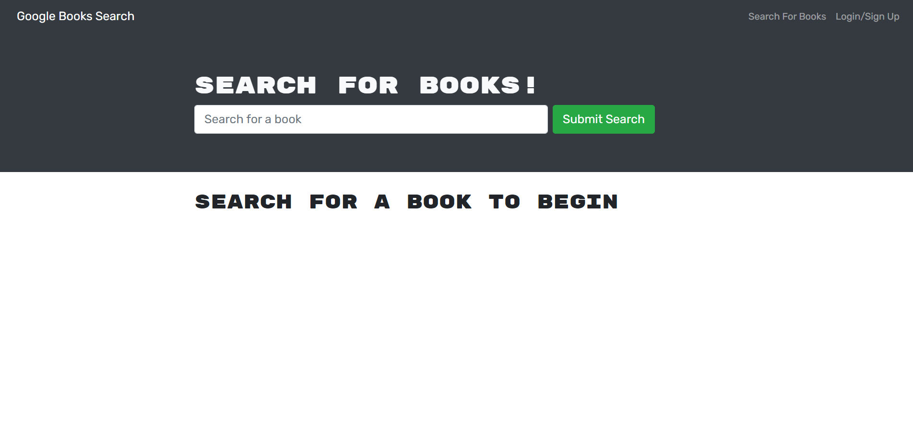

# Book-Search-Engine

## Table of Contents 📜
- [Description](#description)
- [Application Preview](#application-preview)
- [Installation](#installation)
- [Links](#links)
- [Criteria](#criteria)
- [Technologies](#technologies)
- [Questions](#questions)
- [License](#license)

## Description
A full stack application utilizing GraphQL/Apollo, React, and Google Book's search engine API.

## Application Preview

    

## Installation
- Copy the repository to your system
- Create .env file
    - SET MONGODB_URI to mongoDB URI
- ** In connection.js, comment out 'require('dotenv').config()'
    - This will use local mongodb rather than mongodb atlas
- npm install
- npm run develop to launch the application

## Links
-   Github Repository:
    - https://github.com/axe714/Book-Search-Engine
-   Heroku Deployed:
    - https://allecbooksearch.herokuapp.com/

## Criteria
- Set up an Apollo Server to use GraphQL queries and mutations to fetch and modify data, replacing the existing RESTful API.

- Modify the existing authentication middleware so that it works in the context of a GraphQL API.

- Include schema settings for resolvers and typeDefs as outlined in the Challenge instructions.

- Create an Apollo Provider so that requests can communicate with an Apollo Server.

- Application must be deployed to Heroku.

## Technologies
- MongoDB
- Express
- React
- NodeJS
- GraphQL
- Bcrypt

## Questions
Questions? Concerns?  Contact Me Below:
- Github Username: axe714
- Github Link: https://github.com/axe714
- Email: allecarzadon@gmail.com

## License
- Copyright 2022 Allec Arzadon
- Licensed under the: [MIT License](https://opensource.org/licenses/MIT) 